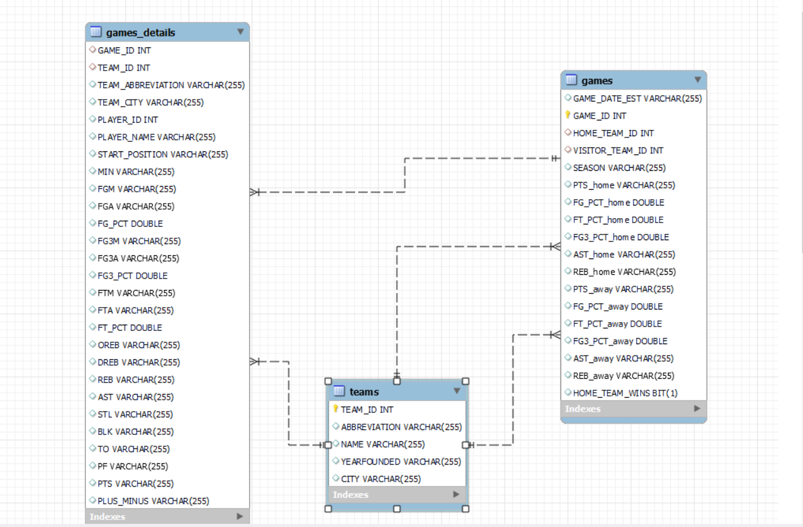

# Projeto_Final_Modulo_03: Cesta de Dados :basketball:

<h2 id="sobre">Sobre </h2>

Projeto Final do Módulo 03 do curso da Resilida Educação. Consiste em utilizar um banco de dados e através do MySQL criar e resolver perguntas através do banco de dados escolhido.
O projeto precisaria, também, estar de acordo com os seguintes objetivos:

- Estruturar o esquema do banco de dados:
 A partir da avaliação do conjunto de dados fornecidos, modelar as tabelas
do banco. Note que não é necessário mapear todas as colunas de todas
as tabelas. Mantenha sua implementação simples construindo um
modelo que atende às perguntas elaboradas pelo grupo.
- Realizar carga no banco:
 Com base no esquema desenhado e criado, subir os dados presentes nos
arquivos para o banco de dados a fim de verificar o funcionamento da
solução encontrada.
- Ideação/Brainstorm sobre perguntas que podem ser respondidas pelos dados:
 Análise o conjunto de dados selecionado para que as perguntas sejam
pertinentes.
- Criar visualizações dos dados com base nas perguntas elaboradas na sprint.
- Montar uma apresentação a partir das perguntas e análise exploratória feita em
cima do conjunto de dados selecionado.

 

<h2 id="linguagens">Linguagens & Ferramentas utilizadas no projeto :books:</h2>

  - [x] MySQL WorkBench
  - [x] Git
  - [x] Miro
  - [x] Excel

<h2 id="gráficos">Gráficos Estatísticos do Projeto :bar_chart:</h2>

##

*Consulte a documentação do GitHub em* 
[como criar uma solicitação pull](https://help.github.com/en/github/collaborating-with-issues-and-pull-requests/creating-a-pull-request). 
*Consulte a documentação do GitHub em* 
[como criar e deletar branch](https://docs.github.com/en/pull-requests/collaborating-with-pull-requests/proposing-changes-to-your-work-with-pull-requests/creating-and-deleting-branches-within-your-repository).

## Link do repositório:
https://github.com/LucasBinho/Projeto_Final_Modulo_03

 

<h2 id="autores">Autores :male_detective: :female_detective:</h2>

  - [Camila Reis](https://github.com/cxavier6)
  - [Gabriel Christ](https://github.com/Gcc10bin)
  - [Gustavo Pereira](https://github.com/gnlto)
  - [Lucas Passos](https://github.com/LucasBinho)
  - [Ramom Ferraz](https://github.com/ramomfrz)
  

  
